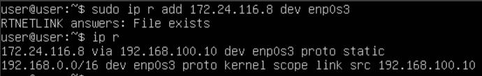
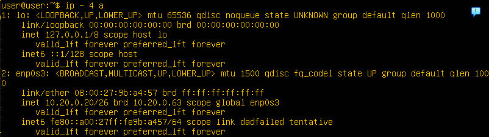
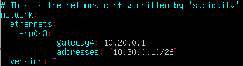
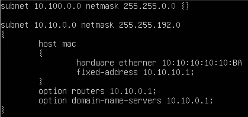

# Linux Network (сети в Linux)

## Part 1. Инструмент ipcalc

- Вывела версию Ubuntu: ***Ububtu 20.04.06 LTS \n \l***:

### 1.1. Сети и маски

1) Определила адрес сети ***192.167.38.54/13***.

2) Выполнила перевод маски ***255.255.255.0*** в префиксную и двоичную запись, ***/15*** в обычную и двоичную, ***11111111.11111111.11111111.11110000 (255.255.255.240, так как Ipcalc не принимает маски в двоичной записи)*** в обычную и префиксную:

3) Минимальный и максимальный хост в сети ***12.167.38.4***. при масках:

- ***/8*** и ***11111111.11111111.00000000.00000000 (255.255.0.0)***.

- ***255.255.254.0*** и ***/4***.

  > Маска подсети — это битовая маска для определения по IP-адресу адреса подсети и адреса узла (хоста, компьютера, устройства) этой подсети.
  > В отличие от IP-адреса маска подсети не является частью IP-пакета.
  > Благодаря маске можно узнать, какая часть IP-адреса узла сети относится к адресу сети, а какая — к адресу самого узла в этой сети.
  > Также с помощью маски подсети можно определить подсети IP-адресов. Например, один диапазон IP-адресов будет в одной подсети, а другой диапазон — в другой подсети.
  > Разбиение одной большой сети на несколько маленьких подсетей позволяет упростить маршрутизацию.

### 1.2. localhost

- Определа, можно ли обратиться к приложению, работающему на localhost, со следующими IP: ***194.34.23.100 (нет), 127.0.0.2 (да), 127.1.0.1 (да), 128.0.0.1 (нет)***:

  > Обратная петля `loopback` позволяет компьютеру связываться с самим собой, используя протоколы сетевых подключений.

### 1.3. Диапазоны и сегменты сетей

1) Определила какие из перечисленных IP можно использовать в качестве публичного, а какие только в качестве частных: ***10.0.0.45, 134.43.0.2, 192.168.4.2, 172.20.250.4, 172.0.2.1, 192.172.0.1, 172.68.0.2, 172.16.255.255, 10.10.10.10, 192.169.168.1***:

  
    - Публичные: 134.43.0.2, 172.0.2.1, 192.172.0.1, 172.68.0.2, 192.169.168.1.

    - Частные: 10.0.0.45, 192.168.4.2, 172.20.250.4, 172.16.255.255, 10.10.10.10.

    > Частные IP-адреса зарезервированы для использования в частных сетях и недоступны из Интернета. Они попадают в определённые диапазоны, определённые RFC 1918:
    >
    > - с 10.0.0.0 по 10.255.255.255 (10.0.0.0/8);
    > - с 172.16.0.0 по 172.31.255.255 (172.16.0.0/12);
    > - с 192.168.0.0 по 192.168.255.255 (192.168.0.0/16).

## Part 2. Статическая маршрутизация между двумя машинами

- С помощью команды ***ip a*** посмотрела существующие сетевые интерфейсы:

- Описала сетевой интерфейс, соответствующий внутренней сети, на обеих машинах и задал следующие адреса и маски: ws1 - ***192.168.100.10, маска /16***, ws2 - ***172.24.116.8, маска /12***:

- Выполнила команду ***netplan apply*** для перезапуска сервиса сети:

### 2.1. Добавление статического маршрута вручную

- Добавила статический маршрут от одной машины до другой и обратно приукпомощи команды вида ***ip r add***:

- Пропинговала соединение между машинами:

### 2.2 Добавление статического маршрута с сохранением

- Перезапустила машины и добавила статический маршрут от одной машины до другой с помощью файла ***/etc/netplan/00-installer-config.yaml***:

- Пропинговала соединение между машинами:

## Part 3. Утилита iperf3

### 3.1. Скорость соединения

- Перевела ***8 Mbps в MB/s, 100 MB/s в Kbps, 1 Gbps в Mbps***:

|Value   |Convert    |Basis              |
|--------|-----------|-------------------|
|8 Mbps  |1 MB/s     |1 Mbps = 0.125 MB/s|
|100 MB/s|800000 Kbps|1 MB/s = 8000 Kbps |
|1 Gbps  |1000 Mbps  | 1 Gbps = 1000 Mbps|

### 3.2. Утилита iperf3

- Измерь скорость соединения между ws1 и ws2:

## Part 4. Сетевой экран

### 4.1. Утилита iptables

- Создала файл ***/etc/firewall.sh***, имитирующий фаерволл, на ws1 и ws2:
  1) На ws1 применила стратегию, когда в начале пишется запрещающее правило, а в конце пишется разрешающее правило (это касается пунктов 4 и 5);
  2) На ws2 применила стратегию, когда в начале пишется разрешающее правило, а в конце пишется запрещающее правило (это касается пунктов 4 и 5);
  3) Открыла на машинах доступ для порта 22 (ssh) и порта 80 (http);
  4) Запретила echo reply (машина не должна «пинговаться», т.е. должна быть блокировка на OUTPUT);
  5) Разрешила echo reply (машина должна «пинговаться»).

  > Разница между файлами заключается в том, что в первом файле первым подходящим правилом для пакета является запрет, а во втором - разрешение. Применяется только первое подходящее правило, остальные игнорируются.

### 4.2. Утилита nmap

- Командой ***ping*** нашла машину, которая не «пингуется», после чего утилитой **nmap** показал, что хост машины запущен:

## Part 5. Статическая маршрутизация сети

- Подняла пять виртуальных машин (3 рабочие станции (***ws11, ws21, ws22***) и 2 роутера (***r1, r2***)):

### 5.1. Настройка адресов машин

- Настроила конфигурации машин в ***etc/netplan/00-installer-config.yaml***:

- Перезапустила сервис сети. Командой ***ip -4 a*** проверила, что адрес машины задан верно. Также пропинговала ws22 с ws21. Аналогично пропинговала r1 с ws11:

### 5.2. Включение переадресации IP-адресов

- Включила переадресации IP, выполнив команду ***sysctl -w net.ipv4.ip_forward=1*** на роутерах:

  > При таком подходе переадресация не будет работать после перезагрузки системы.

- Открыла файл ***/etc/sysctl.conf*** и добавила в него ***net.ipv4.ip_forward = 1***:

  > При использовании этого подхода, IP-переадресация включена на постоянной основе.

### 5.3. Установка маршрута по-умолчанию

- Настроила маршрут по-умолчанию (шлюз) для рабочих станций. Для этого добавила ***default*** перед IP роутера в файле конфигураций:

- Вызвала ***ip r*** и показала, что добавился маршрут в таблицу маршрутизации:

- Используя команду ***tcpdump -tn -i eth0***, пропинговала с ws11 роутер r2 и показала на r2, что пинг доходит:

### 5.4. Добавление статических маршрутов

- Добавила в роутеры r1 и r2 статические маршруты в файле конфигураций:

- Вызовала ***ip r*** и показала таблицы с маршрутами на обоих роутера:

- Запустила команды ***ip r list 10.10.0.0/[маска сети]*** и ***ip r list 0.0.0.0/0*** на ws11:

  >Потому что он более точный и узконаправленный. Система выбирает маршрут с наибольшей спецификой (наименьшая маска сети) для определённого адреса. Маршрут по умолчанию (0.0.0.0/0) применяется только в том случае, если нет более специфического маршрута. Это позволяет направлять трафик в нужное место более эффективно.

### 5.5. Построение списка маршрутизаторов

- Запустила на r1 команду дампа ***tcpdump -tnv -i eth0***. При помощи утилиты ***traceroute*** построила список маршрутизаторов на пути от ws11 до ws21:

  > Команда traceroute linux использует UDP пакеты. Она отправляет пакет с TTL=1 и смотрит адрес ответившего узла, дальше TTL=2, TTL=3 и так пока не достигнет цели. Каждый раз отправляется по три пакета и для каждого из них измеряется время прохождения. Когда утилита traceroute получает сообщение от целевого узла о том, что порт недоступен трассировка считается завершенной.

### 5.6. Использование протокола ICMP при маршрутизации

- Командой ***tcpdump -n -i eth0 icmp*** pапустила на r1 перехват сетевого трафика, проходящего через eth0. Пропинговала с ws11 несуществующий IP (например, 10.30.0.111):

## Part 6. Динамическая настройка IP с помощью DHCP

- Для r2 настроила в файле ***/etc/dhcp/dhcpd.conf*** конфигурацию службы ***DHCP***:

  1) Указала адрес маршрутизатора по-умолчанию, DNS-сервер и адрес внутренней сети:
  

  2) В файле ***resolv.conf*** прописала ***nameserver 8.8.8.8***:
  

- Перезагрузила службу ***DHCP*** командой ***systemctl restart isc-dhcp-server***. Машину ws21 перезагрузила при помощи ***reboot*** и через ***ip a*** показала, что она получила адрес. Также пропинговала ws22 с ws21:

- Указала MAC-адрес у ws11, для этого в ***etc/netplan/00-installer-config.yaml*** добавила строки: ***macaddress: 10:10:10:10:10:BA***, ***dhcp4: true***:

- Для r1 настроила аналогично r2, но сделала выдачу адресов с жесткой привязкой к MAC-адресу (ws11). Также провела аналогичные тесты:

- Запросила с ws21 обновление ip адреса:

## Part 7. NAT

- В файле ***/etc/apache2/ports.conf*** на ws22 и r1 изменила строку ***Listen 80*** на ***Listen 0.0.0.0:80***, то есть сделала сервер Apache2 общедоступным:

- Запустила веб-сервер Apache командой ***service apache2 start*** на ws22 и r1:

- Добавила в фаервол, созданный по аналогии с фаерволом из Части 4, на r2 следующие правила:
  1) Удаление правил в таблице filter - ***iptables -F***;

  2) Удаление правил в таблице "NAT" - ***iptables -F -t nat***;

  3) Отбрасывать все маршрутизируемые пакеты - ***iptables --policy FORWARD DROP***.
  

  - Проверила соединение между ws22 и r1 командой ***ping***:

  4) Разрешила маршрутизацию всех пакетов протокола **ICMP**:

  - Проверила соединение между ws22 и r1 командой ***ping***:

  5) Включила ***SNAT***, а именно маскирование всех локальных ip из локальной сети, находящейся за r2 (по обозначениям из Части 5 - сеть 10.20.0.0).
  6) Включила ***DNAT*** на 8080 порт машины r2 и добавить к веб-серверу Apache, запущенному на ws22, доступ извне сети

  - Проверила соединение по TCP для ***SNAT***, для этого с ws22 подключилась к серверу Apache на r1

  - Проверила соединение по TCP для ***DNAT***, для этого с r1 подключилась к серверу Apache на ws22 командой ***telnet*** (по адресу r2 и порту 8080)

## Part 8. Дополнительно. Знакомство с SSH Tunnels

- Запустила на r2 фаервол с правилами из Части 7:

- Запустила веб-сервер ***Apache*** на ws22 только на localhost (то есть в файле ***/etc/apache2/ports.conf*** изменила строку ***Listen 80*** на ***Listen localhost:80***):

- Воспользовалась ***Local TCP forwarding*** с ws21 до ws22, чтобы получить доступ к веб-серверу на ws22 с ws21:

- Воспользовалась ***Remote  TCP forwarding*** с ws11 до ws22, чтобы получить доступ к веб-серверу на ws22 с ws11:

- Для проверки, сработало ли подключение в обоих предыдущих пунктах, перешела во второй терминал и выполнила команду ***telnet 127.0.0.1 [локальный порт]***:

- Сохранила дампы образов виртуальных машин:
